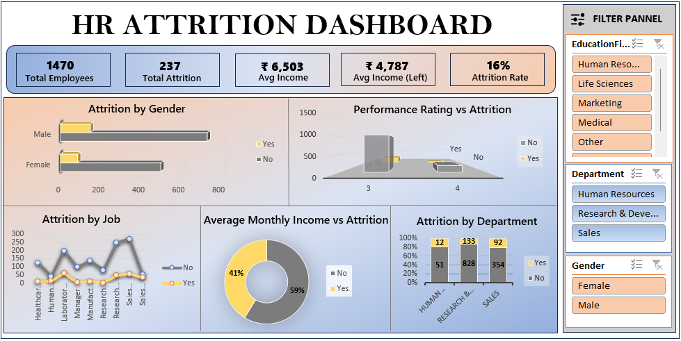

# HR Attrition Dashboard - Excel Project

📊 An interactive HR analytics dashboard built entirely in Microsoft Excel using:
- Pivot Tables
- Slicers
- KPI cards
- Dynamic charts (bar, pie, 3D column, line)

## 📁 Dataset
IBM HR Analytics Employee Attrition dataset (~1470 rows) with attributes like:
- Age, Gender, Department, Education Field
- Monthly Income, YearsAtCompany, Attrition, PerformanceRating, etc.

## ✅ Key KPIs
- Total Employees
- Total Attrition
- Average Monthly Income
- Attrition Rate
- Avg Income (Attrited Only)

## 📊 Visualizations
- Attrition by Department, Gender, Job Role
- Performance Rating vs Attrition
- Income vs Attrition Comparison

## 📎 Files Included
- `HR-Employee-Attrition.xlsx` – Full Excel workbook with all analysis & dashboard
- `HR-Attrition.png` – Final dashboard preview

## 📷 Dashboard Snapshot

🔗 LinkedIn: [www.linkedin.com/in/sakshi-ubale]  
